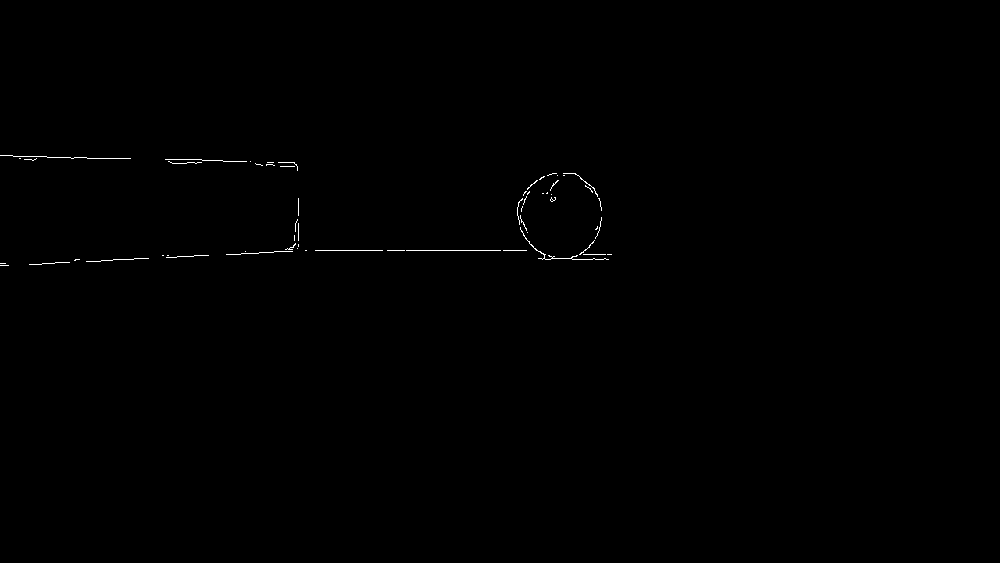
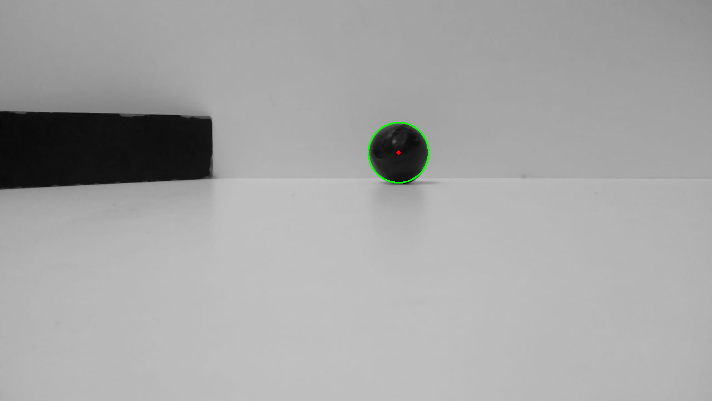
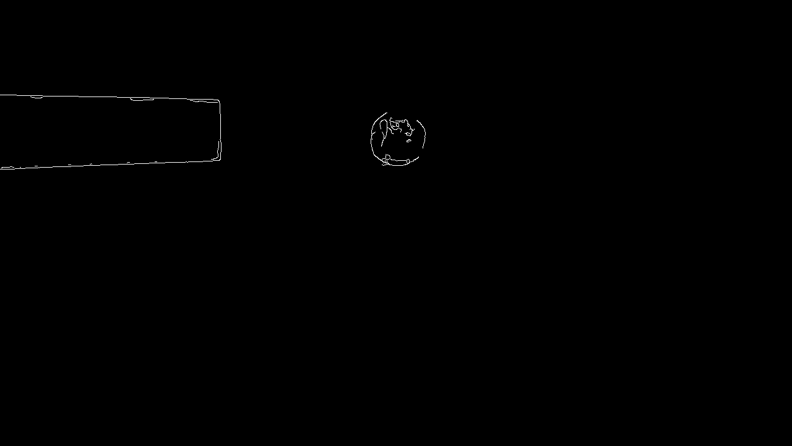
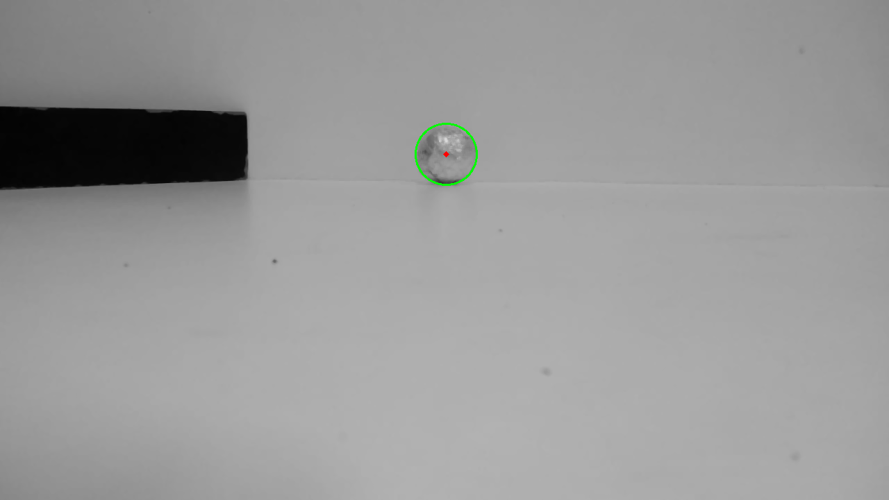
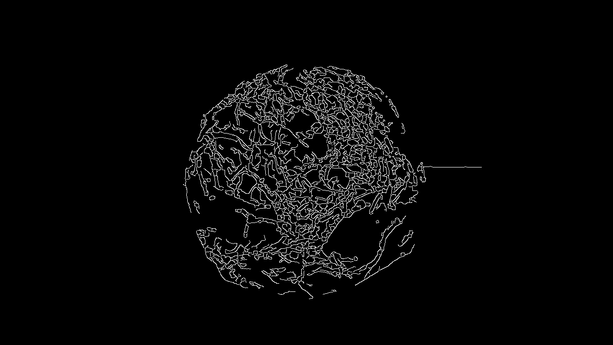
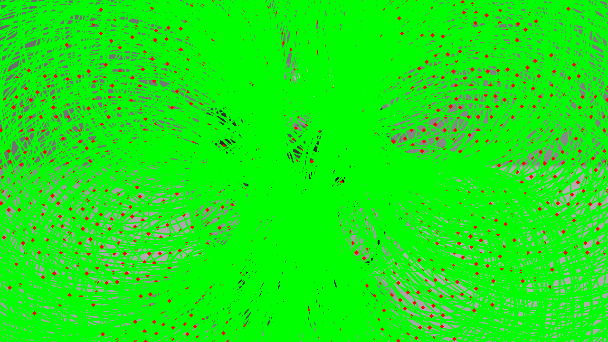
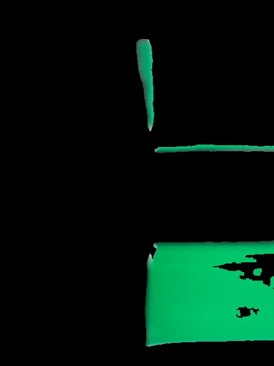
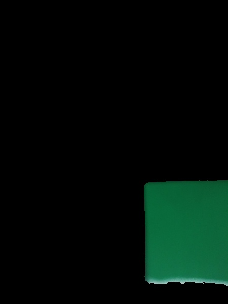
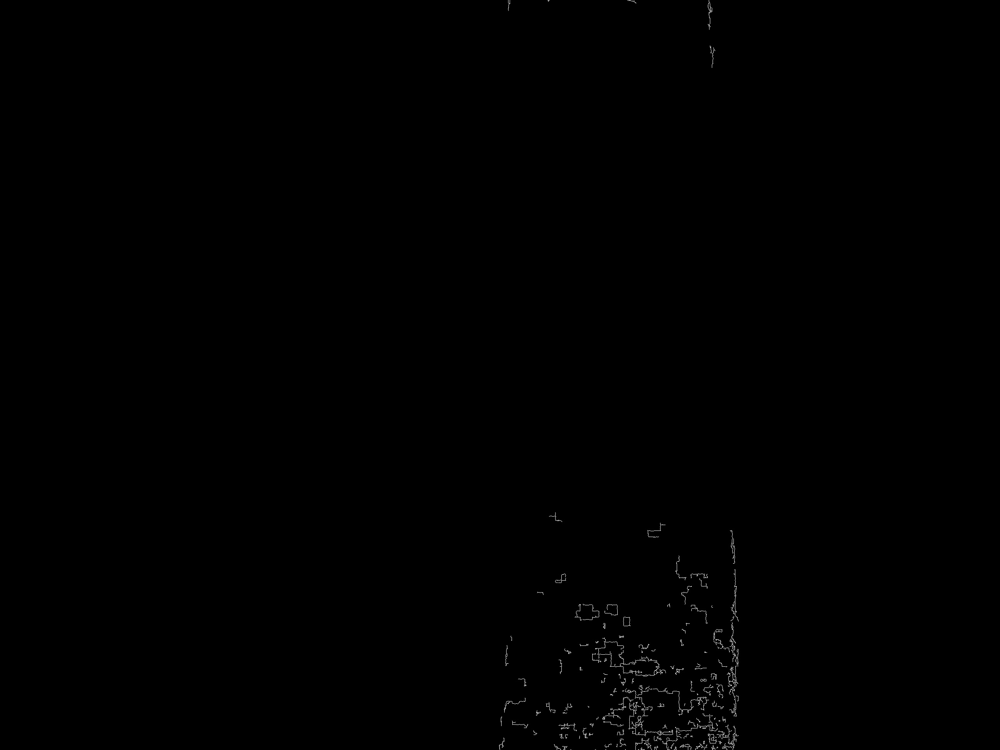
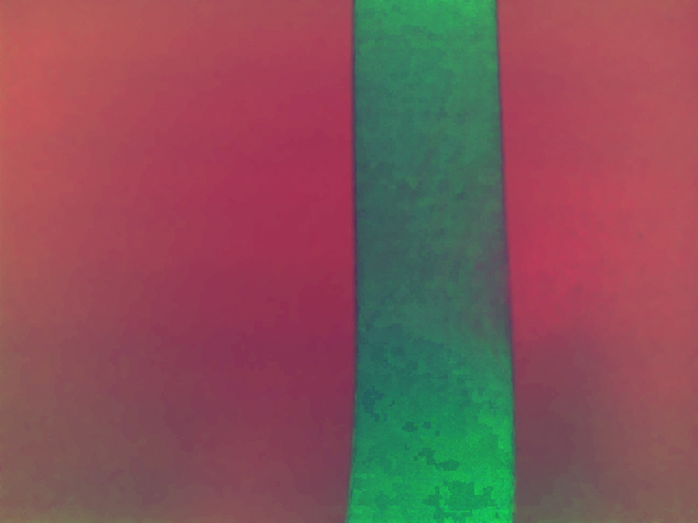

# OBR-TASKS-IMAGE-DETECT

Usando Visão Computacional para identificar e superar desafios trazidos pela [OBR-2019](http://www.obr.org.br/modalidade-pratica/como-participar-modalidade-pratica/), o controlador utilizado seria uma raspberry por conta da sua capacidade de processar dados e a facilidade na integração com outros hardwares. Os desafios são basicamente identificar: bola, linha preta, fita verde, interseção na linha preta. Além disso está configurada a comunicação serial entre a raspberry e um arduino.

Para testar basta instalar o opencv e você poderá testar os módulos separadamente, através de imagens armazenadas no próprio repositório:
```
sudo apt-get install python3-opencv
```

## [blackDetect.py](.lib/blackDetect.py)

Responsável por detectar os dois tipos de bolas existentes, pretas e prateadas.

### BOLA PRETA EDGE


### BOLA PRETA PERTO DO TRIÂNGULO EDGE


### BOLA PRETA PERTO DO TRIÂNGULO CIRCLES


### BOLA CINZA PERTO DO TRIÂNGULO EDGE


### BOLA CINZA PERTO DO TRIÂNGULO CIRCLES


### BOLA CINZA DE PERTO


### BOLA CINZA DE PERTO


## [greenDetect.py](./lib/greenDetect.py)

Identifica os pontos verdes que podem existir nas interseções da linha, identificando para qual lado o robô deve seguir.

### VERDE ATRÁS


### VERDE NA ESQUERDA


## [lineDetect.py](./lib/lineDetect.py)

Identifica em que ponto da linha o robô está e informa para qual lado ele deve ir para consertar.

### LINHA CANNY


### LINHA CVT-COLOR
